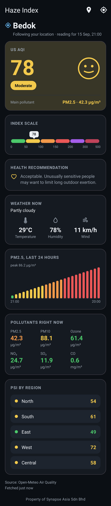
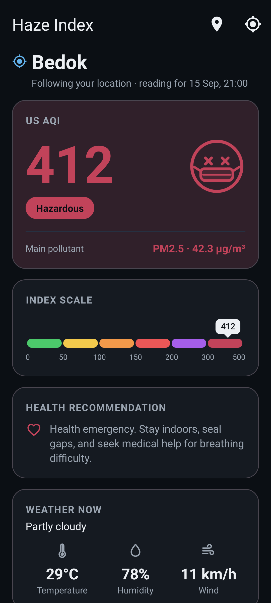

# Haze Index

An Android app that opens on **the air where your phone is** and shows the current haze /
air quality index for it. The layout follows [iqair.com](https://www.iqair.com) as its
reference: a colour-coded headline index with a matching face, the pollutant that is
driving that number, an index ruler, health guidance and a weather strip.

**Swipe down on the main screen and it goes out to the internet and pulls a fresh reading** —
there is no background cache being re-served, every pull is a live HTTP request.

<p align="center">
  
  
</p>

## Download

Pre-built APKs are in [`dist/`](dist/):

| File | Notes |
| --- | --- |
| `dist/HazeIndex-1.2.1.apk` | Release build, ~4.7 MB — install this one |
| `dist/HazeIndex-1.2.1-debug.apk` | Debug build, same app with debug symbols |

Install on the phone: copy the APK across (or download it from GitHub on the device), open it,
and allow "install from unknown sources" when Android asks. Android 7.0 (API 24) or newer.

Both APKs are signed with the standard Android **debug** keystore so they install without extra
steps. That key is fine for sideloading and testing; swap in a real keystore in
`app/build.gradle.kts` before publishing to a store.

## Capturing the current location

The app is location-first. On a fresh install it asks for the position straight away and
opens on the device's own reading — there is no toggle to go and find.

- The first fix comes from the cached position when that is under five minutes old, otherwise
  the app asks for a live one (network provider first — it fixes fast indoors and is accurate
  enough for an air quality grid cell) and falls back to a stale fix rather than showing nothing.
- While the app is on screen it listens for position updates and **re-fetches automatically once
  you have moved 3 km**, rate-limited to one automatic refresh every 5 minutes. Updates stop the
  moment the app goes to the background, so it does not sit on the radio.
- The place name comes from the device geocoder, so the header reads "Bedok" rather than
  a pair of coordinates.
- **Inside Singapore the local reading still uses the official NEA PSI**, including the regional
  breakdown, so it matches what local advisories quote. Elsewhere it uses US AQI.
- Follow mode is remembered across restarts, and the last known place is shown straight away
  while the new fix is acquired.
- Only `ACCESS_COARSE_LOCATION` is requested, and it stays optional: refuse it and the app drops
  back to the city list rather than sitting on an error. The prompt is raised once — after that
  the **Use my location** button on the screen takes over. If location is switched off
  system-wide the app says so and offers a shortcut to the settings screen. Picking a city from
  the list turns following off; the toolbar toggle turns it back on.

## What it shows

- **Headline index** — Singapore's official **PSI (24-hour)** from NEA, or **US AQI** everywhere
  else — colour-coded Good → Hazardous, with a matching face and the health advice for that band.
- **Main pollutant** — which pollutant is actually driving the index, with its concentration.
  Computed from a full set of US EPA sub-index tables, not just PM2.5.
- **Index ruler** — the whole scale as coloured steps with a marker showing where this reading
  falls, so a number like 174 means something without looking it up.
- **Weather now** — temperature, humidity and wind, the way IQAir pairs weather with air quality.
- **24-hour PM2.5 trend** — one bar per hour, each coloured by how bad that hour was, so you can
  see whether the haze is building or clearing.
- **Current pollutants** — PM2.5, PM10, ozone, NO₂, SO₂ and CO, each coloured by **its own**
  sub-index, so one bad pollutant stands out instead of hiding behind the headline.
- **PSI by region** for Singapore (north / south / east / west / central).
- **Last saved reading** when the phone is offline, clearly labelled as cached.

Fixed locations: Singapore, Kuala Lumpur, Johor Bahru, George Town, Kuching, Kota Kinabalu,
Jakarta, Pekanbaru, Palembang, Pontianak, Bangkok, Chiang Mai, Manila, Bandar Seri Begawan,
Hanoi, Ho Chi Minh City, Phnom Penh.

## Data sources

All free and needing no API key, so there is nothing to configure before the first run.

- [Open-Meteo Air Quality API](https://open-meteo.com/en/docs/air-quality-api) —
  `https://air-quality-api.open-meteo.com/v1/air-quality` — global pollutant concentrations,
  US AQI and the hourly PM2.5 history.
- [Open-Meteo Forecast API](https://open-meteo.com/en/docs) —
  `https://api.open-meteo.com/v1/forecast` — the temperature / humidity / wind strip. Best
  effort: if it fails the air quality reading is still shown.
- [data.gov.sg / NEA PSI](https://data.gov.sg/) —
  `https://api-open.data.gov.sg/v2/real-time/api/psi` (falls back to the older
  `https://api.data.gov.sg/v1/environment/psi`) — the official Singapore PSI, which is the
  number local advisories quote during a haze episode.

For Singapore the app calls both: NEA supplies the headline PSI and the regional breakdown,
Open-Meteo supplies the trend line. If NEA is unreachable the app degrades to US AQI rather
than failing.

### A note on the sub-index maths

The EPA averages ozone and CO over 8 hours and NO₂/SO₂ over 1 hour before reading its tables.
The feed serves a current hourly value, which is what the app uses — the same shortcut every
live "current AQI" display makes. Gases are converted from µg/m³ to ppb/ppm at 25 °C and 1 atm
before the table is applied. See `AirQuality.kt`.

## Building from source

```bash
export ANDROID_HOME=/path/to/android-sdk   # needs platform 35 + build-tools 35.0.0
./gradlew :app:assembleRelease             # -> app/build/outputs/apk/release/
./gradlew :app:testDebugUnitTest           # unit tests
```

JDK 17 or newer, Gradle wrapper included (8.11.1), AGP 8.7.3, Kotlin 2.0.21.

The test suite is not only arithmetic. `ScreenRenderTest` inflates the real layout under
Robolectric, starts the activity and draws the whole tree for every band, so a broken id, a
bad vector path or an out-of-bounds canvas call fails the build instead of the first phone it
lands on. `ScreenshotTest` renders the screen to PNGs in `app/build/screenshots/` — that is
where the images at the top of this file come from.

## Code map

| File | Role |
| --- | --- |
| `MainActivity.kt` | UI, swipe-to-refresh wiring, city picker, permission flow |
| `HazeViewModel.kt` | Refresh state machine and follow-the-device tracking; survives rotation |
| `DeviceLocation.kt` | Position fixes, foreground position updates, reverse geocoding |
| `HazeRepository.kt` | The network calls and JSON parsing |
| `AirQuality.kt` | US EPA AQI sub-index tables and the main-pollutant pick |
| `ReportCache.kt` | Last reading persisted to `SharedPreferences` |
| `TrendView.kt` | Hand-drawn 24-hour PM2.5 bar chart (no charting dependency) |
| `ScaleBarView.kt` | Hand-drawn index ruler with the "you are here" marker |
| `Model.kt` | Report model plus the PSI / US AQI / PM2.5 band thresholds |
| `Cities.kt` | Location catalogue, the device "city", and the distance maths |

## Known limitation

The APKs here were compiled and tested in a sandbox whose egress policy blocks
`open-meteo.com` and `data.gov.sg`, so the **live responses have never been exercised end to
end** — the parsers were written against the documented response shapes and are defensive
(missing fields, `null` readings, v2→v1 endpoint fallback, `current`→latest-hourly fallback,
weather failures isolated from the air quality call), but the first real run on a phone is the
first time the JSON is actually seen. If a field ever moves, `HazeRepository.kt` is the single
place to adjust.

The same applies to the location code: there is no GPS or geocoder in that sandbox, so the
follow-the-device path was built and unit tested (distance maths, the Singapore bounding box,
the stable device-city id) but never exercised against a real fix.

---

Property of Synapse Asia Sdn Bhd
