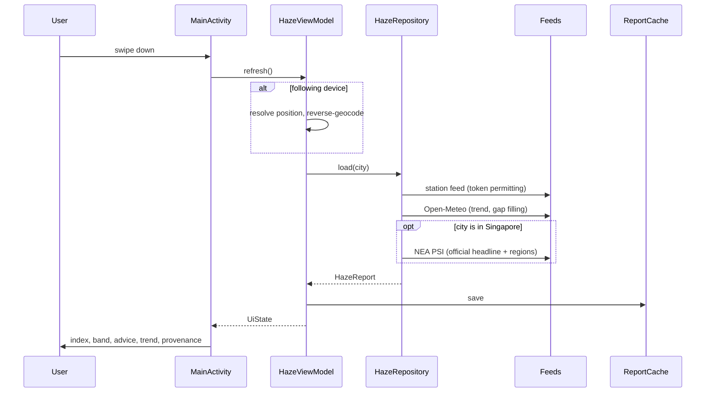
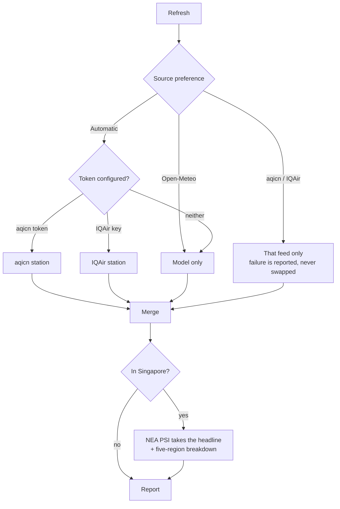
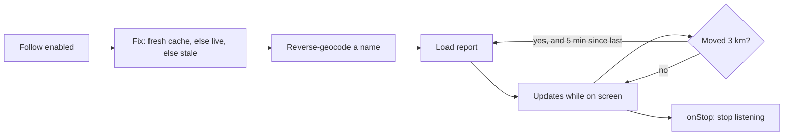

# Haze Index — the whole workflow

How this app was built, how it behaves at runtime, and how to build, verify and extend it.
Written from the actual session that produced it, including the things that went wrong.

- **Repo:** `steve9nlee-web/BeyondExplain`, branch `claude/haze-index-apk-app-fol9rv`
- **App:** `com.beyondexplain.hazeindex` — Android 7.0 (API 24) and up
- **Current:** v1.7 (versionCode 8), release APK ~5.5 MB in [`dist/`](dist/)

---

## 1. What the app does

Shows the current haze / air quality index for a location in Southeast Asia. **Swipe down and
it goes to the internet for a fresh reading** — every pull is a live HTTP request, nothing is
re-served from memory. It can follow the device's own position, and it plots readings across an
interactive map.

---

## 2. Build order

Six requests, six commits. Each row is one round trip: what was asked, the judgement call it
needed, and what proved it worked.

| # | Commit | Asked for | Key decision | Verified by |
|---|---|---|---|---|
| 1 | `89a0dc0` | An APK that pulls live haze data on swipe-down | Views + `SwipeRefreshLayout` over Compose: smaller, faster to build, fewer deps. Open-Meteo for global coverage with no API key | Build, signature, 4 unit tests |
| 2 | `b9ec090` | Follow the device location | Promote a one-shot location read into a *mode* that persists and re-fetches on movement | +3 tests (distance maths, SG bounding box, stable device id) |
| 3 | `7e9f445` | "Not that accurate — try IQAir or aqicn.org" | Correct diagnosis: the model was a *simulation*, not a measurement. Restructured around station feeds | +15 tests, every feed parsed from a captured response |
| 4 | `cddd659` | An interactive map, chosen location on top | osmdroid + OpenStreetMap: no API key, no Play Services | +11 tests (bounds feed, grid, viewport maths) |
| 5 | `d51021d` | Use the supplied seal as the app logo | Measure the emblem, generate the full density set, disc-cut so launchers don't box it | Lint back to baseline, 0 icon warnings |
| 6 | `8830e0e` | "The app top section is blocked" | Real defect: `targetSdk 35` forces edge-to-edge and nothing handled window insets | +4 Robolectric tests, **checked against the unfixed code first** |
| 7 | `54c461b` | Merge the pollutant sub-indices into the AQI card | One card for the whole current picture; a screenshot finally made the layout judgeable | Layout rendered to a PNG and inspected |
| 8 | this one | "Why is the index totally different from IQAir?" | Not a bug: the app was in its keyless model fallback. Made that state loud and one tap to fix | 3 tests on the prompt rule; banner rendered |

### What each round actually changed

**1 — Foundations.** Kotlin, `ViewModel` + `LiveData`, `HttpURLConnection` and `org.json` (no
Retrofit/Moshi). Hand-drawn 24-hour PM2.5 chart instead of a charting library. Last reading
cached to `SharedPreferences` so the app opens with numbers, not a spinner.

**2 — Location as a mode.** Fresh cached fix when it's under five minutes old, otherwise a live
single update with a timeout, falling back to a stale fix rather than nothing. Re-fetches after
3 km of movement, at most once every 5 minutes, and only while the app is on screen.

**3 — Measured over modelled.** The accuracy complaint was correct and had a specific cause:
Open-Meteo serves CAMS output on a ~11 km grid. Station feeds took over the headline, parsing
moved into pure functions so it could be tested offline, and every screen now states whether a
number was measured or simulated.

**4 — The map.** Station pins where a token allows it, a modelled lattice where it doesn't,
Singapore's official regions layered on whenever they're in view.

**5 — Branding.** The gold seal, measured off the source image (ring 646 px across, centre
350,716) and generated into legacy + adaptive icons.

**6 — Edge-to-edge.** See §7 — this one is worth reading as a lesson, not just a changelog line.

---

## 3. Runtime workflow

### A pull-to-refresh, end to end



### Which source wins



**Merge rules** (`combineReports`, `applyNeaPsi` — both pure functions, both tested):

| Situation | Headline | Concentrations | Trend |
|---|---|---|---|
| aqicn station | station AQI | station sub-indices, tiles relabelled `AQI` | Open-Meteo |
| IQAir station | station US AQI | Open-Meteo (IQAir's free tier has none) | Open-Meteo |
| No key | Open-Meteo US AQI | Open-Meteo, µg/m³ | Open-Meteo |
| Anywhere in Singapore | **NEA PSI**, plus regions | PSI's own where units allow | Open-Meteo |

A source the user picked explicitly is never silently replaced — the reason reaches the banner.

### Following the device



Inside Singapore a device position still uses NEA PSI, via a bounding-box check on the fix.

### The map

Pan or zoom → debounced 700 ms → `loadArea(bounds)`. Movements under a quarter of the viewport
are ignored, so a drag costs one request rather than one per frame. Stations become pins; the
keyless fallback samples a **5×5 lattice in a single request** and draws translucent cells.

---

## 4. Code map

| File | Role |
|---|---|
| `MainActivity.kt` | Detail screen, swipe wiring, city picker, permissions, settings dialog |
| `MapActivity.kt` | Map screen: overlays, viewport reloads, pin taps |
| `HazeViewModel.kt` / `MapViewModel.kt` | Refresh state machines; survive rotation |
| `HazeRepository.kt` | HTTP, the source-priority chain, merge rules, US AQI maths |
| `AirQualityParsers.kt` | One pure parser per feed — the testable core |
| `Model.kt` | Report model, PSI / US AQI / PM2.5 band thresholds |
| `Cities.kt` | Location catalogue, the device "city", distance maths, `MapBounds` |
| `DeviceLocation.kt` | Fixes, foreground updates, reverse geocoding |
| `Settings.kt` / `ReportCache.kt` | API keys and preference / last reading on disk |
| `TrendView.kt` / `MarkerIcons.kt` | Hand-drawn chart and map pins |
| `Insets.kt` | Edge-to-edge window insets |

---

## 5. Build and release

### Bootstrapping a machine

```bash
curl -sSLo cmdline-tools.zip \
  https://dl.google.com/android/repository/commandlinetools-linux-13114758_latest.zip
unzip -q cmdline-tools.zip -d $HOME/android-sdk/cmdline-tools
mv $HOME/android-sdk/cmdline-tools/cmdline-tools $HOME/android-sdk/cmdline-tools/latest
export ANDROID_HOME=$HOME/android-sdk
yes | $ANDROID_HOME/cmdline-tools/latest/bin/sdkmanager --licenses
$ANDROID_HOME/cmdline-tools/latest/bin/sdkmanager \
  "platform-tools" "platforms;android-35" "build-tools;35.0.0"
```

JDK 17+ required. The Gradle wrapper (8.11.1) is committed, so no separate Gradle install.

### The loop used for every change

```bash
./gradlew :app:testDebugUnitTest      # 37 tests
./gradlew :app:lintDebug              # must stay at 0 errors
./gradlew :app:assembleDebug :app:assembleRelease
$ANDROID_HOME/build-tools/35.0.0/apksigner verify app/build/outputs/apk/release/app-release.apk
```

Then bump `versionCode`/`versionName`, copy both APKs into `dist/`, commit, push.

### Toolchain

Kotlin 2.0.21 · AGP 8.7.3 · Gradle 8.11.1 · JVM target 17 · minSdk 24 · compile/targetSdk 35

Runtime deps: `core-ktx 1.13.1`, `appcompat 1.7.0`, `activity-ktx 1.9.3`, `material 1.12.0`,
`constraintlayout 2.1.4`, `swiperefreshlayout 1.1.0`, `lifecycle 2.8.7`, `coroutines 1.8.1`,
`osmdroid 6.1.20`. Test deps: `junit 4.13.2`, `org.json 20250107`, `robolectric 4.13`,
`androidx.test:core 1.6.1`.

### Signing

Release is signed with the **debug** keystore so the APK sideloads with no extra steps. Swap in
a real keystore in `app/build.gradle.kts` before any store release.

---

## 6. Verification, and why it is shaped this way

The build machine could not reach a single one of these APIs, had no GPS, no geocoder, no
display and no KVM for an emulator. Every constraint was compensated deliberately:

| Cannot do | Compensation |
|---|---|
| Call the air quality APIs | Parsers are pure functions over a response body; 26 tests run captured responses through them, success **and** failure |
| Get a position fix | Distance maths, the Singapore bounding box and the stable device-city id are plain Kotlin, tested directly |
| Run an emulator | `org.json` and Robolectric on the JVM classpath; Robolectric starts the real activities |
| See the screen | `ScreenRenderTest` draws the real inflated layout to a PNG via Robolectric's native graphics mode, so a layout change can be looked at before it ships; icons rendered to a preview sheet at true pixel sizes |

**37 tests in 5 classes:**

| Class | n | Covers |
|---|---|---|
| `ParserTest` | 15 | Every feed: aqicn, IQAir, Open-Meteo, NEA v1+v2, and the merge rules |
| `MapDataTest` | 11 | Station bounds, modelled grid, NEA label locations, viewport lattice |
| `ScaleAndParsingTest` | 4 | PSI / US AQI bands, EPA PM2.5→AQI, ISO-8601 parsing |
| `EdgeToEdgeTest` | 4 | Window insets, via the real root→child dispatch path |
| `DeviceLocationLogicTest` | 3 | Haversine distance, SG bounding box, stable device id |

The failure cases matter as much as the happy ones: a bad aqicn token, IQAir's
`incorrect_api_key`, a station reporting `"-"` (which would otherwise plot as a green zero),
Open-Meteo returning an object for one coordinate but an array for many, GeoJSON's
longitude-first ordering (reading it backwards puts a station 12 km off), and a degenerate
viewport.

---

## 7. What went wrong, and what it taught

Worth keeping, because each one changed how the next round was done.

**A wrong test expectation, twice.** Both times the *implementation* was right and the assertion
was wrong — Singapore→Johor Bahru is 17.9 km, not the 26 km guessed; an epoch second was
miscalculated by hand. Lesson: derive expected values from an independent computation, not from
memory.

**Shipping a simulation as if it were a measurement.** v1.0–v1.2 presented modelled grid output
with no indication of what it was. The user was right to push back. The fix was not only better
sources but **stating the provenance on screen** for every number.

**A test that passed for the wrong reason.** The first inset tests dispatched insets *directly at
the child view*. That would still have passed if a parent swallowed them before they arrived —
exactly the failure mode most likely in a `CoordinatorLayout`. They now dispatch at the content
root, the way the real window does.

**The habit that caught real bugs:** before trusting a new test, break the fix and confirm the
test fails. The inset tests were run against the unfixed code and reported
`expected:<96> but was:<0>` — the bug exactly as it looked on screen. A test never seen red is
not yet evidence.

---

## 8. Extending it

**Add a data source** — write a parser object in `AirQualityParsers.kt` (pure, body in, model
out), add a fetch method and a `SourceChoice` entry, then a fixture test. Nothing else changes.

**Add a city** — one line in `Cities.ALL`. Set `useNeaPsi` only for Singapore.

**Change the launcher icon** — measure the artwork's bounds, regenerate `mipmap-*/ic_launcher.png`
(disc-cut, transparent corners) and `ic_launcher_foreground.png` (emblem at 70 dp on the 108 dp
canvas, inside the 72 dp circle every mask is guaranteed to show).

**Adjust a band threshold** — `IndexScale` in `Model.kt`; `ScaleAndParsingTest` guards it.

---

## 9. Open items

- ~~No live response has ever been fetched.~~ **Resolved by a user screenshot:** a real aqicn
  station reading (Minden, Pulau Pinang, 5.6 km away), real reverse-geocoding, and a populated
  trend chart. The feeds, the station merge and the follow-the-device path all work against the
  live services.
- **The model fallback is not a substitute for a station.** Measured against IQAir in George
  Town on 7 Oct 2026: 93.2 µg/m³ of PM2.5 (AQI 177) versus the model's 31.9 µg/m³ (AQI 98).
  Same arithmetic, 2.9× different input. The app now prompts for a free key whenever it is
  running on the model, because no amount of presentation fixes a missing measurement.
- **Headline vs sub-index mismatch.** That same screenshot showed an overall AQI of 88 beside a
  PM2.5 sub-index of 166. Both come from the same aqicn response, so this is upstream: WAQI's
  overall `aqi` and its per-pollutant `iaqi` values are not always on the same averaging window.
  Worth surfacing in the UI rather than leaving the reader to reconcile it.
- **No real position fix, and no tile ever drawn.** Same reason.
- **Debug signing.** Fine for sideloading, not for distribution.
- **Icon text at mdpi.** The ring text reads as a mark rather than words at 48 px — inherent to a
  text-bearing seal at that size. A simplified small-density variant is available on request.
